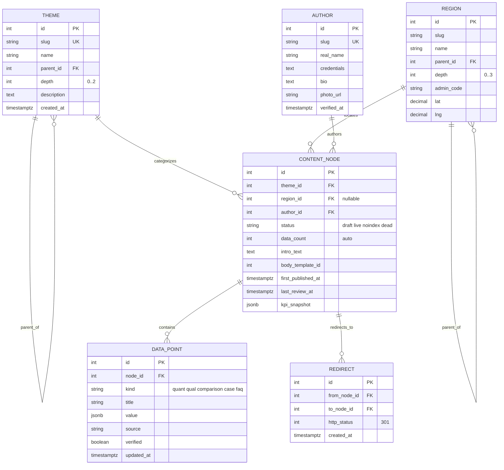
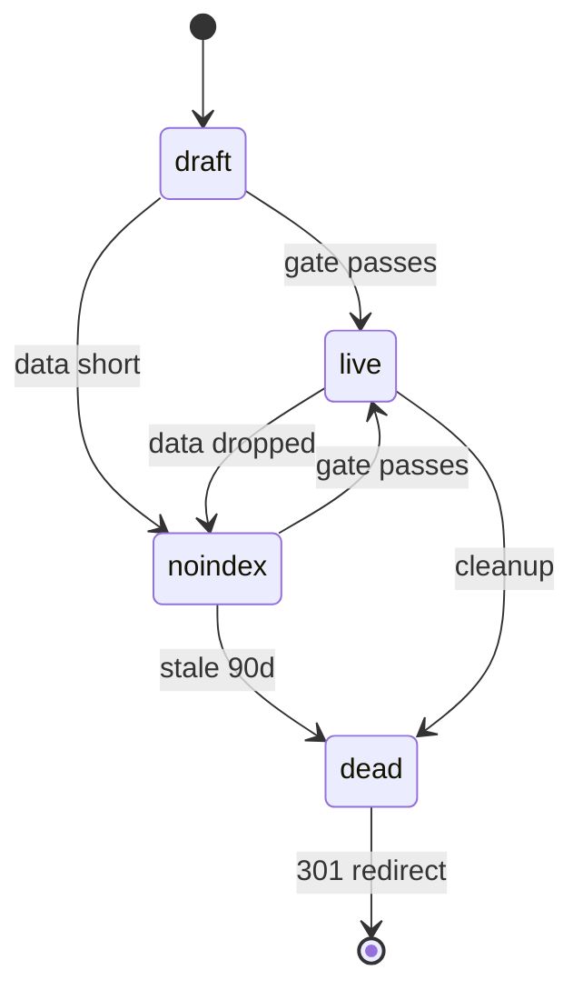

# SEO 프로젝트 ERD 지도

> **목적:** 다(多)테마 × 지역 SEO 전략을 코드 레벨 데이터 모델로 결정론적 표현한다.
> **출처:** `seo-12month-strategy-final.md`, `sitemap-backend-operations-report.md`
> **렌더링 가이드:** Mermaid `erDiagram`

---

## 0. 설계 원칙 (한 페이지 요약)

| 원칙 | 설명 |
|------|------|
| **사이트맵은 데이터의 그림자** | URL/페이지는 손으로 만들지 않는다. 엔티티 상태로부터 자동 도출된다. |
| **운영자가 만지는 것은 5개 엔티티뿐** | `Theme`, `Region`, `Author`, `ContentNode`, `DataPoint` |
| **발행 게이트는 코드 레벨로 강제** | `data_count >= 5` (`verified=true`) 미달이면 DB 트리거가 거부 |
| **노드는 정확히 하나의 부모를 갖는다** | `(theme_id, region_id)` UNIQUE → 카니발리제이션 원천 차단 |
| **부모는 자식보다 먼저 발행** | `parent.status = 'live'`가 아니면 자식은 `live` 불가 |

---

## 1. ERD — 핵심 엔티티 다이어그램

핵심 5개 엔티티와 그 관계입니다. `Theme`과 `Region`은 자기 참조 트리, `ContentNode`는 두 트리의 *교차점*이며, `DataPoint`가 발행 게이트의 *재료*입니다.



---

## 2. 엔티티별 상세 책임

### 2.1 `Theme` — 테마 트리

테마는 사이트의 *축*입니다. 너무 많이 잡으면 권위가 분산됩니다.

| 제약 | 이유 |
|------|------|
| `depth <= 2` | 루트 → 1차 테마 → 2차 세부까지만. 3차 이상은 사일로가 흩어진다. |
| `(parent_id, slug)` UNIQUE | 같은 부모 아래 동일 slug 금지 |
| 1차 테마 3~5개 권장 | Phase 0에서 결정. 너무 많으면 토픽 권위가 안 잡힌다. |

### 2.2 `Region` — 지역 트리

행정구역 체계와 1:1 매핑. 한국 기준 4단계 트리입니다.

| `depth` | 의미 | 개수(한국 기준) |
|---------|------|------------------|
| 0 | 전국 (가상 루트) | 1 |
| 1 | 시도 | 17 |
| 2 | 시군구 | 약 228 |
| 3 | 동/읍/면 | 약 3,500 |

**핵심:** `depth=3`까지의 모든 행은 *시드 데이터*로 미리 넣어두지만, `ContentNode`로 발행하는 것은 데이터가 채워진 일부 칸뿐입니다.

### 2.3 `Author` — E-E-A-T 신호의 원천

> 모든 페이지에는 `author_id`가 강제됩니다. `verified_at IS NULL`인 작성자의 노드는 `live`로 승급할 수 없습니다.

이 제약이 익명 SEO 양산을 차단합니다.

### 2.4 `ContentNode` — 페이지의 추상 단위

이 보고서의 *심장*입니다. 한 행이 *하나의 잠재 페이지*에 대응합니다.

| 제약 | 강제 위치 |
|------|-----------|
| `(theme_id, region_id)` UNIQUE | INSERT 시점 (DB 레벨) |
| `status='live'`는 `data_count >= 5` 필요 | `BEFORE UPDATE` 트리거 |
| `region_id`가 NULL이 아니면 `region.parent`까지 모두 `live`인 부모 노드가 있어야 함 | API 레이어 + 트리거 |
| `intro_text` 비어 있으면 `live` 불가 | 트리거 |

### 2.5 `DataPoint` — 페이지를 페이지답게 만드는 재료

| `kind` | 예시 |
|--------|------|
| `quantitative` | "강남구 매칭 가능 선생님 12명" |
| `qualitative` | 학교 목록, 학원가 분포, 교통 |
| `comparison` | "서초구 대비 평균 시급 8% 높음" |
| `case` | 매칭 사례, 실제 후기 (동의받은 것만) |
| `faq` | 지역/테마 특화 Q&A |

`verified=true`인 것만 `data_count`에 반영됩니다. *5개의 검증된 데이터*가 발행 게이트의 정확한 정의입니다.

### 2.6 `Redirect` — 무덤 관리

`ContentNode.status = 'dead'`로 바뀌면 *자동으로* `Redirect` 행이 생성됩니다. 가장 가까운 살아있는 `live` 노드로 301을 거는 것이 기본 규칙입니다. 운영자가 손으로 등록하지 않습니다.

---

## 3. 상태 전이 — `ContentNode.status`

페이지의 일생을 4개 상태로 추상화합니다.



**전이 라벨의 정확한 의미:**

| 전이 | 라벨 읽이 | 실제 조건 |
|------|-----------|-----------|
| `draft → live` | `gate passes` | `data_count >= 5` AND `author.verified` AND `parent.status = 'live'` AND `intro_text` 존재 |
| `draft → noindex` | `data short` | `data_count` 1~4 또는 `intro_text` 비어 있음 |
| `noindex → live` | `gate passes` | 위와 동일한 발행 게이트 통과 |
| `noindex → dead` | `stale 90d` | 90일 이상 진전 없음 |
| `live → noindex` | `data dropped` | `data_count`가 5 미만으로 떨어짐 |
| `live → dead` | `cleanup` | 분기 정검에서 트래픽 0이고 90일 이상 미갱신 |
| `dead → [*]` | `301 redirect` | 가장 가까운 살아있는 `live` 노드로 자동 리다이렉트 |

**상태 전이의 핵심 불변성:**

1. `draft → live`는 *발행 게이트*를 통과해야만 가능합니다.
2. `live → dead`는 *분기 정검*에서만 일어납니다 (자동 트리거 + 사람의 최종 확인).
3. `dead`로 전이되는 순간 `Redirect`가 자동 생성됩니다.
4. 모든 상태 변경은 *이력 테이블*에 기록됩니다 (운영자 교체 대비).

---

## 4. 핵심 트리거 — 데이터 무결성 안기 강제

| 트리거 이름 | 발동 시점 | 동작 |
|-------------|-----------|------|
| `trg_publish_gate` | `BEFORE UPDATE ON content_node` | `status='live'`인데 `data_count<5`면 거부 |
| `trg_refresh_data_count` | `AFTER INSERT/UPDATE/DELETE ON data_point` | 부모 노드의 `data_count` 재계산 |
| `trg_unique_theme_region` | `BEFORE INSERT ON content_node` | `(theme_id, region_id)` 중복 거부 |
| `trg_parent_live_check` | `BEFORE UPDATE ON content_node` | 부모가 `live`가 아니면 자식의 `live` 거부 |
| `trg_dead_cascade_redirect` | `AFTER UPDATE ON content_node` | `dead`로 전이되면 `Redirect` 자동 생성 |
| `trg_region_depth_check` | `BEFORE INSERT/UPDATE ON region` | `parent_id IS NULL`인데 `depth > 0`이면 거부 |
| `trg_theme_depth_check` | `BEFORE INSERT/UPDATE ON theme` | `depth > 2`면 거부 |

**이 트리거들은 *코드 외부에서도* 무결성을 보장합니다.** SQL 콘솔에서 직접 INSERT를 시도해도 막힙니다. Month 2~3 충돌 시기에 우회 시도를 차단하는 것이 단일 목적입니다.

---

## 5. URL 결정 함수 — ERD에서 URL로

URL은 *데이터의 결정론적 함수*입니다. 손으로 만들지 않습니다.

```
url(node) = "/" + theme_path(node.theme) + "/" + region_path(node.region) + "/"

theme_path(t)  = recursive concat of slug from theme root to t
region_path(r) = recursive concat of slug from sido to r (empty if region is NULL)
```

### 5.1 결과 패턴 예시

| `theme.slug` 경로 | `region.slug` 경로 | 생성 URL |
|-------------------|---------------------|-----------|
| `tutoring` | (NULL) | `/tutoring/` |
| `tutoring` | `seoul` | `/tutoring/seoul/` |
| `tutoring` | `seoul/gangnam-gu` | `/tutoring/seoul/gangnam-gu/` |
| `tutoring` | `seoul/gangnam-gu/daechi-dong` | `/tutoring/seoul/gangnam-gu/daechi-dong/` |
| `guides/how-to-choose-tutor` | (NULL) | `/guides/how-to-choose-tutor/` |

### 5.2 Recursive CTE 예시 (PostgreSQL)

```sql
-- region_path 계산
WITH RECURSIVE region_chain AS (
    SELECT id, parent_id, slug, depth,
           slug::text AS path
    FROM region
    WHERE id = :target_id

    UNION ALL

    SELECT r.id, r.parent_id, r.slug, r.depth,
           r.slug || '/' || rc.path
    FROM region r
    JOIN region_chain rc ON r.id = rc.parent_id
    WHERE r.depth >= 1
)
SELECT path FROM region_chain WHERE parent_id IS NULL OR depth = 1;
```

---

## 6. ERD가 보장하는 것 — 강제되는 5가지 불변성

이 데이터 모델은 *설계만으로* 다음 5가지를 강제합니다.

| 불변성 | 강제 방법 |
|--------|-----------|
| 같은 (테마, 지역) 위의 페이지는 하나뿐 | `UNIQUE(theme_id, region_id)` |
| 데이터 5개 미만 페이지는 `live` 불가 | `trg_publish_gate` |
| 부모 없는 자식 페이지는 `live` 불가 | `trg_parent_live_check` |
| 작성자 미검증 페이지는 `live` 불가 | `trg_publish_gate` 확장 |
| `dead` 페이지는 자동으로 301 등록 | `trg_dead_cascade_redirect` |

운영자의 의지에 의존하지 않으면서, *코드와 DB가* 사이트 권위 신호를 지킵니다.

---

## 7. 시드 데이터 정의 — Phase 0 산출물

Phase 0(Week 1~2) 종료 시점의 DB 상태입니다.

| 테이블 | 시드 행 수 | 비고 |
|--------|-----------|------|
| `theme` | 4~6 | 루트 1 + 1차 테마 3~5 |
| `region` | 약 3,750 | 전국 1 + 시도 17 + 시군구 228 + 동 약 3,500 |
| `author` | 3~5 | E-E-A-T 신호용 설명 작성자 |
| `content_node` | 0 | 페이지는 아직 0개 |
| `data_point` | 0 | 데이터 입력 시스템만 준비 |

**핵심:** Phase 0에서는 *페이지가 0개*입니다. 데이터 골격만 완성됩니다. 첫 페이지는 Phase 1(Month 1)부터 발행됩니다.

---

## 8. 핵심 메시지

1. **5개 엔티티가 사이트 전체를 결정한다.** URL, 사이트맵, 페이지 발행 여부 모두 이 5개에서 자동 도출됩니다.
2. **트리거가 사람의 의지를 대체한다.** Month 2~3 충돌 시기에도 DB가 잘못된 발행을 거부합니다.
3. **`(theme, region)` UNIQUE 한 줄이 카니발리제이션을 원천 봉쇄한다.** 같은 키워드를 두 페이지가 노릴 수 없습니다.
4. **`Redirect`는 자동 생성된다.** 운영자가 무덤을 손으로 관리하지 않습니다.
5. **이 ERD는 12개월 후 700개 페이지까지 확장 가능하다.** Year 2 이후 새 테마/지역을 추가해도 구조 변경이 필요 없습니다.
