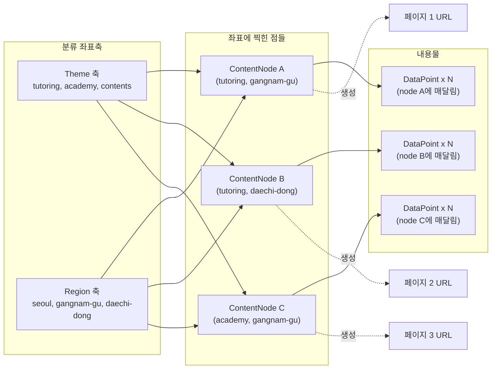
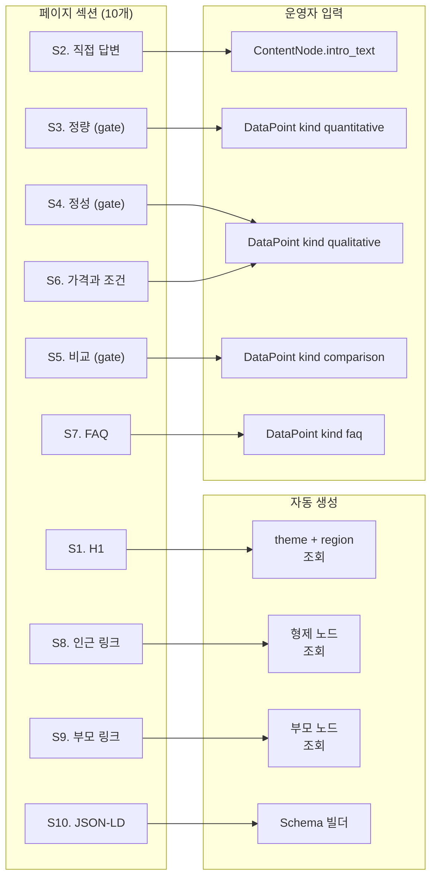
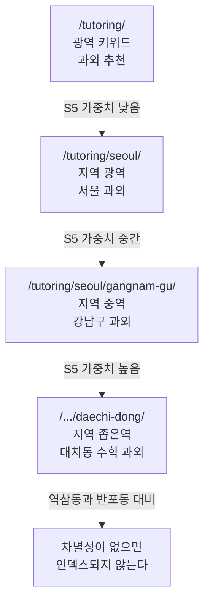
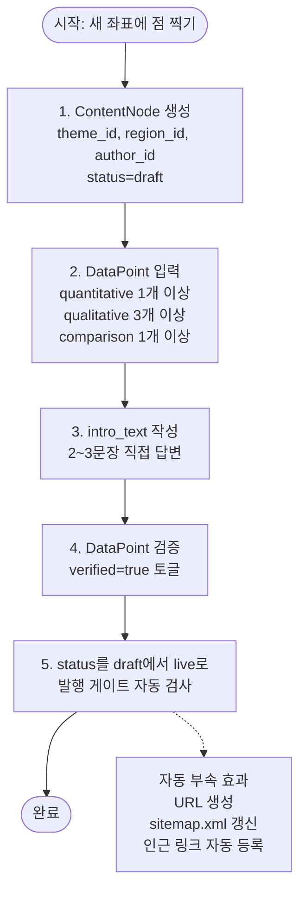

# 페이지 구조와 엔티티 매핑 보고서

> **목표:** 다(多)테마 × 지역 SEO 사이트에서 *하나의 페이지가 어떤 엔티티에 어떻게 대응되는가*, 그리고 *세부 페이지는 어떤 구조로 만들어져야 하는가*를 결정론적으로 정의한다.
> **작성일:** 2026년 5월
> **선행 보고서:** `seo-12month-strategy-final.md`, `sitemap-backend-operations-report.md`, `erd-map.md`, `sitemap.md`

---

## 0. 핵심 통찰 (한 페이지 요약)

이 보고서의 모든 라인은 다음 두 문장에서 출발합니다.

> **하나의 페이지는 하나의 `ContentNode` 행이다. 다른 엔티티는 페이지가 아니다.**
>
> **세부 페이지의 구조는 데이터 모델의 그림자다. 섹션 충실도와 발행 게이트는 같은 말이다.**

이 두 문장을 받아들이면 다음이 자동으로 따라옵니다.

| 결과 | 이유 |
|------|------|
| `Theme`/`Region`을 추가해도 페이지가 생기지 않는다 | 좌표축에는 페이지가 없다 |
| 페이지 구조와 발행 조건이 분리되지 않는다 | §3·4·5 섹션 = `data_count` 게이트 |
| 운영자가 페이지 레이아웃을 만지지 않는다 | 코드가 엔티티에서 자동 생성한다 |
| 깊이별 템플릿이 같아도 콘텐츠가 다르다 | 좌표가 다르므로 매달린 DataPoint가 다르다 |

---

## 1. 페이지와 엔티티의 관계 — 점과 좌표축

### 1.1 5개 엔티티의 역할 재정의

선행 보고서(`erd-map.md`)의 5개 엔티티를 *페이지가 되는가*의 관점에서 재분류합니다.

| 엔티티 | 페이지가 되는가? | 역할 |
|--------|------------------|------|
| `Theme` | ✗ | 분류 축. 트리의 한 축. |
| `Region` | ✗ | 분류 축. 트리의 다른 축. |
| `Author` | ⊿ (예외) | `/about/authors/<slug>/` 한 페이지만 매핑. SEO 본질은 아님. |
| **`ContentNode`** | **✓** | **페이지의 추상 단위. 1행 = 1 URL.** |
| `DataPoint` | ✗ | 페이지의 *내용물*. 페이지 안의 섹션으로 렌더링된다. |

`Theme`과 `Region`은 *좌표축*이고, `ContentNode`는 *그 좌표에 찍힌 점*입니다. 페이지는 점에만 대응됩니다.

### 1.2 좌표 모델 — 시각화



**핵심 규칙:** *축이 아니라 점이 페이지가 된다.* `Region`에 "강남구"를 새로 데이터로 넣어도 페이지는 0개입니다. `ContentNode(theme=tutoring, region=강남구)` 행을 만들고, 그 행에 `DataPoint` 5개를 채우고, `status='live'`로 승급해야 페이지 한 장이 태어납니다.

### 1.3 이 모델이 강제하는 5가지 결과

| 결과 | 강제 방법 |
|------|-----------|
| 페이지는 항상 (테마, 지역) 좌표를 갖는다 | `ContentNode`의 두 FK가 NOT NULL (region은 허브 예외) |
| 같은 좌표의 페이지는 1개뿐 | `UNIQUE(theme_id, region_id)` |
| 좌표축만 있고 점이 없으면 페이지가 없다 | `ContentNode` 행이 없으면 URL이 생성되지 않는다 |
| 데이터 없는 점은 발행되지 않는다 | `data_count >= 5` 발행 게이트 |
| 점이 사라지면 URL도 사라진다 | `status='dead'` 시 `Redirect` 자동 등록 |

---

## 2. 세부 페이지의 표준 구조 — 10개 섹션

### 2.1 섹션 정의

선행 보고서(`seo-12month-strategy-final.md` §4)의 10개 섹션을 엔티티 매핑과 함께 재정의합니다.

| § | 섹션 이름 | 역할 | 데이터 출처 |
|---|----------|------|-------------|
| 1 | H1 (정확한 키워드) | 검색 쿼리 일치 | `theme.name` + `region.name` 자동 조합 |
| 2 | 직접 답변 블록 | AI 인용 / 첫 화면 가치 | `ContentNode.intro_text` |
| 3 | **★ 정량 데이터** | 차별성 신호 | `DataPoint(kind=quantitative)` |
| 4 | **★ 정성 데이터** | 차별성 신호 | `DataPoint(kind=qualitative)` |
| 5 | **★ 차별 분석** | 차별성 신호 | `DataPoint(kind=comparison)` |
| 6 | 가격/시간/조건 | 사용자 의도 충족 | `DataPoint(kind=qualitative)` 또는 캐시 |
| 7 | FAQ | 롱테일 쿼리 + Schema | `DataPoint(kind=faq)` |
| 8 | 인근 지역 링크 | 사일로 내 수평 링크 | 같은 부모의 형제 `live` 노드 |
| 9 | 부모 페이지 링크 | 권위 되돌림 (위쪽) | `region.parent` + 같은 `theme` |
| 10 | Schema.org JSON-LD | 검색 결과 리치 표시 | author + theme + region + DataPoint |

★ 표시는 §3·§4·§5가 *발행 게이트의 대상*입니다.

### 2.2 섹션 → 엔티티 매핑 시각화



**관찰:** 10개 섹션 중 *운영자가 직접 입력하는 것은 §2 + §3·4·5·6·7뿐*입니다. 나머지 §1·§8·§9·§10은 코드가 다른 엔티티로부터 자동 생성합니다. 운영자는 페이지가 아니라 *데이터 좌표와 데이터 점*만 만집니다.

### 2.3 발행 게이트의 정확한 정의 — 섹션 충실도의 강제망

`erd-map.md`의 발행 게이트는 다음과 같이 *섹션 단위*로 풀어쓸 수 있습니다.

```
canPublish(node) =
    node.intro_text is not empty                        # §2 통과
    AND count(DataPoint, kind=quantitative, verified=true) >= 1   # §3 통과
    AND count(DataPoint, kind=qualitative,  verified=true) >= 3   # §4 통과
    AND count(DataPoint, kind=comparison,   verified=true) >= 1   # §5 통과
    AND total verified DataPoint count >= 5                       # 합계 게이트
    AND node.author.verified_at is not null
    AND node.parent.status = 'live'
```

**§3·§4·§5의 합이 자연스럽게 5를 넘기 때문에** *발행 게이트와 차별성 섹션은 같은 망*입니다. 둘을 분리할 수 없습니다.

### 2.4 와이어프레임 — 표준 세부 페이지

이 보고서의 디자이너가 같은 그림을 보도록, 동(洞) 페이지를 기준으로 와이어프레임을 정의합니다.

```mermaid
flowchart TB
    subgraph Page["/tutoring/seoul/gangnam-gu/daechi-dong/"]
        H1["S1. H1: 대치동 수학 과외"]
        Intro["S2. 3문장 직접 답변"]
        Quant["S3. 정량 데이터<br/>매칭 12명, 평균 시급 65000"]
        Qual["S4. 정성 데이터<br/>학교, 학원가, 교통"]
        Comp["S5. 차별 분석<br/>역삼동과 반포동 대비 차이"]
        Price["S6. 가격, 시간, 조건"]
        FAQ["S7. FAQ"]
        Near["S8. 인근 지역<br/>역삼동, 도곡동, 개포동"]
        Parent["S9. 상위로<br/>강남구 전체 보기"]
        Author["작성자 + 갱신일"]
        JSONLD["S10. JSON-LD"]
    end

    H1 --> Intro
    Intro --> Quant
    Quant --> Qual
    Qual --> Comp
    Comp --> Price
    Price --> FAQ
    FAQ --> Near
    Near --> Parent
    Parent --> Author
    Author --> JSONLD
```



---

## 3. 깊이별 페이지 차이 — 같은 템플릿, 다른 농도

세부 페이지가 모두 같은 구조라고 해서 같은 콘텐츠 농도는 아닙니다. *깊이에 따라* 강조 섹션과 권장 데이터 수가 달라집니다.

### 3.1 깊이별 권장 농도

| 깊이 | 페이지 종류 | 예시 URL | 강조 섹션 | DataPoint 권장 수 |
|------|-------------|----------|-----------|---------------------|
| 1 | 테마 허브 | `/tutoring/` | §1, §2, §7 + *자식 시도 목록* | 5~10 (상위 개념 중심) |
| 2 | 시도 | `/tutoring/seoul/` | §3, §4 + *자식 시군구 목록* | 8~15 |
| 3 | 시군구 | `/tutoring/seoul/gangnam-gu/` | §3, §4, §5 (모두 중요) | 10~20 |
| 4 | 동 | `/.../daechi-dong/` | §3, §4, §5 (좁은 차별성 필수) | 5~10 (최소치 통과) |

### 3.2 깊이가 깊을수록 §5(차별 분석)가 중요한 이유

상위 페이지일수록 *광역 키워드*를 노리고, 하위 페이지일수록 *좁은 키워드*를 노립니다. 좁아질수록 *인근 좌표와의 차이*가 발견 가능한 신호가 됩니다.



**규칙:** 동 페이지는 *인근 동과 무엇이 다른지*를 명확히 보여주지 못하면 인덱스되지 않습니다. 같은 시군구의 동 페이지들이 §5만 다르고 §3·§4가 비슷하면, Google은 그것을 *프로그래매틱 양산*으로 인식합니다.

### 3.3 허브 페이지 vs 동 페이지 — 강조점이 뒤집힌다

| 비교 항목 | 테마 허브 (깊이 1) | 동 페이지 (깊이 4) |
|-----------|---------------------|---------------------|
| 콘텐츠 길이 | 5,000자+ | 1,500~2,500자 |
| 메인 신호 | 토픽 권위 (broad) | 좌표 차별성 (narrow) |
| 자식 목록 | 핵심 섹션 (§8 자리에 자식 시도 목록) | 작은 섹션 (인근 동 4~6개) |
| §5 비중 | 작음 | **가장 큼** |
| §7 (FAQ) 깊이 | 일반적 질문 8~12개 | 지역 특화 3~5개 |
| 갱신 주기 | 반기 점검 | 분기 점검 |

---

## 4. 권장 페이지 구조 — 깊이별 템플릿 4종

페이지 템플릿은 *4개*뿐입니다. 1만 개 페이지가 있어도 4개 템플릿으로 충분합니다.

### 4.1 템플릿 카탈로그

| 템플릿 ID | 적용 깊이 | 핵심 차이 |
|-----------|-----------|-----------|
| `T_HUB` | 0~1 (사이트 루트, 테마 허브) | 자식 트리 시각화 + 토픽 개요 강조 |
| `T_SIDO` | 2 (시도) | 자식 시군구 매트릭스 + 광역 데이터 |
| `T_SIGUNGU` | 3 (시군구) | 표준 10섹션 풀 (§5 비중 큼) |
| `T_DONG` | 4 (동) | 표준 10섹션 + 인근 동 비교 강조 |

`ContentNode.body_template_id`에 이 4개 중 하나가 들어갑니다. 운영자는 템플릿을 *고르지 않습니다.* 코드가 `theme.depth`와 `region.depth`로부터 자동 결정합니다.

```
template = decide_template(theme.depth, region.depth)
```

### 4.2 자동 결정 규칙

| `theme.depth` | `region.depth` | 결과 템플릿 |
|---------------|-----------------|--------------|
| 0 (루트) | NULL | `T_HUB` (사이트 루트) |
| 1 (테마 허브) | NULL | `T_HUB` (테마 허브) |
| 1~2 | 1 (시도) | `T_SIDO` |
| 1~2 | 2 (시군구) | `T_SIGUNGU` |
| 1~2 | 3 (동) | `T_DONG` |

이 함수가 결정론적이므로, *같은 좌표에는 항상 같은 템플릿*이 적용됩니다. 운영자가 잘못 선택해서 사일로가 흐트러지는 일이 일어나지 않습니다.

---

## 5. 안티패턴 — 이렇게 만들면 안 됨

| 안티패턴 | 무엇이 깨지는가 | 왜 나쁜가 |
|----------|------------------|--------------|
| 모든 동 페이지가 템플릿 변수만 다른 텍스트 | §3·4·5의 차별성 | Google이 *프로그래매틱 SEO*로 분류 → 일괄 디인덱스 |
| §3·4·5 없이 §6·7만 가득 | 발행 게이트 우회 시도 | 차별 데이터 0 → Soft 404 처리 |
| 한 `ContentNode`에 여러 URL | URL 결정론 | `(theme, region)` UNIQUE 제약으로 DB가 거부 |
| 부모가 `noindex`인데 자식만 `live` | 권위 흐름 | `trg_parent_live_check` 트리거가 거부 |
| 동 페이지에서 다른 시군구 동으로 직접 링크 | 사일로 무결성 | 사일로 침범 → 무결성 검사기 알림 |
| `Theme`/`Region`을 추가하는데 페이지가 자동 생성됨 | 발행 게이트 | 좌표축은 페이지가 아니다. `ContentNode` 명시 생성 필요 |
| 페이지 안에 다른 페이지의 §3 데이터를 끌어와 표시 | DataPoint 소유권 | DataPoint는 정확히 하나의 노드에 속한다 |
| 깊이 5 이상 URL | 크롤 깊이 | Google이 도달하지 못하는 깊이 |

---

## 6. 운영자의 페이지 생성 흐름 — 좌표를 점으로 바꾸는 일

운영자가 *새 페이지 한 장*을 만드는 데 필요한 작업을 5단계로 정의합니다. URL이나 HTML은 만지지 않습니다.

### 6.1 5단계 워크플로



### 6.2 단계별 예상 시간 추정

| 단계 | 작업 | 예상 시간 | 자동화 여부 |
|------|------|-----------|--------------|
| 1 | `ContentNode` 행 생성 | 30초 | 매트릭스 뷰에서 클릭 한 번 |
| 2 | DataPoint 5~7건 입력 | 30분~2시간 | 데이터 수집 시 단축 |
| 3 | `intro_text` 작성 | 10~20분 | 수동 (LLM 보조 가능) |
| 4 | 검증 토글 | 5분 | 검토 시간 확인 후 토글 |
| 5 | `live` 승급 | 0초 (트리거 자동) | 게이트 통과 시 즉시 |

**한 페이지 평균 1~3시간.** 데이터 수집이 자동화되면 30분으로 단축됩니다. 1~3시간 × 700개 = 700~2,100시간. 12개월(약 250 영업일) × 4시간/일 = 1,000시간. *데이터 자동 수집이 없으면 12개월 안에 700페이지는 어렵습니다.* 이것 `sitemap-backend-operations-report.md` §9.1이 강조한 *데이터 입력 병목*의 정량적 의미입니다.

---

## 7. 페이지 구조 점검 체크리스트

발행 직전에 다음을 통과해야 합니다. (선행 보고서 부록 A 확장형)

### 7.1 콘텐츠 게이트

- [ ] §1 H1에 `theme.name + region.name` 정확히 포함
- [ ] §2 `intro_text` 2~3문장 작성됨
- [ ] §3 정량 데이터 ≥ 1개 (verified)
- [ ] §4 정성 데이터 ≥ 3개 (verified)
- [ ] §5 차별 분석 섹션 ≥ 1개 (verified)
- [ ] §3+§4+§5 합계 ≥ 5개
- [ ] §7 FAQ ≥ 3개 (지역/테마 특화)

### 7.2 구조 게이트

- [ ] `(theme_id, region_id)` 좌표 UNIQUE
- [ ] `parent.status = 'live'` (부모가 살아있음)
- [ ] §8 인근 지역 링크 ≥ 3개
- [ ] §9 부모 페이지 링크 1개
- [ ] 다른 테마로의 직접 링크 0개

### 7.3 신뢰 게이트

- [ ] `author.verified_at` NOT NULL
- [ ] §10 LocalBusiness 또는 Article Schema
- [ ] §10 FAQPage Schema
- [ ] 갱신일 자동 표시

### 7.4 기술 게이트

- [ ] 모바일 LCP < 2.5초
- [ ] 깊이 ≤ 4
- [ ] canonical URL 자기 자신
- [ ] `sitemap.xml`에 자동 등록

**모든 항목이 자동 검사 가능합니다.** 사람이 체크리스트를 들고 다닐 필요가 없습니다.

---

## 8. ERD 지도 / 사이트맵과의 교차 참조

이 보고서는 단독으로 읽지 않고, 다른 두 보고서와 *상호 보완적*입니다.

| 이 보고서의 개념 | 정의된 곳 | 활용처 |
|-------------------|-----------|--------|
| 5개 엔티티 정의 | `erd-map.md` §1 | 본 보고서 §1 |
| `(theme, region)` UNIQUE | `erd-map.md` §2.4 | 본 보고서 §1.3, §5 |
| 발행 게이트 함수 | `erd-map.md` §4 | 본 보고서 §2.3 |
| 4단계 URL 트리 | `sitemap.md` §1 | 본 보고서 §3 |
| 5개 운영 뷰 | `sitemap.md` §3 | 본 보고서 §6 (매트릭스 뷰 사용) |
| 사일로 무결성 검사 | `sitemap.md` §3.4 | 본 보고서 §5 (안티패턴 검출) |

**읽기 순서 권장:**

1. `seo-12month-strategy-final.md` — 왜 이렇게 해야 하는가 (전략)
2. `erd-map.md` — 데이터 모델은 무엇인가 (구조)
3. `sitemap.md` — 운영이 어떻게 굴러가는가 (운영)
4. **본 보고서** — 페이지 한 장이 어떻게 만들어지는가 (생산)

---

## 9. 핵심 메시지

1. **하나의 페이지는 하나의 `ContentNode` 행이다.** 다른 엔티티는 좌표축이거나 내용물이다.
2. **`Theme`/`Region`을 추가해도 페이지는 자동 생성되지 않는다.** 좌표에 점을 찍는 작업이 명시적으로 필요하다.
3. **세부 페이지는 10개 섹션으로 구성된다.** 그중 §3·§4·§5(정량/정성/비교)가 발행 게이트의 정확한 의미이다.
4. **페이지 템플릿은 4종(`T_HUB`, `T_SIDO`, `T_SIGUNGU`, `T_DONG`)뿐이다.** 좌표 깊이로부터 자동 결정된다.
5. **깊이가 깊을수록 §5(차별 분석)가 중요해진다.** 동 페이지는 인근 동과의 차이가 없으면 인덱스되지 않는다.
6. **운영자는 페이지가 아니라 좌표와 데이터 점만 만진다.** URL, 사이트맵, 템플릿 선택, 인근 링크는 모두 코드가 만든다.
7. **페이지 구조와 발행 게이트는 같은 망이다.** §3·§4·§5의 충실도가 곧 `data_count >= 5`이다.

---

## 10. 즉시 결정해야 할 두 가지

다음이 정해져야 페이지 템플릿 구현을 진입할 수 있습니다.

1. **§6(가격/시간/조건)을 `DataPoint(qualitative)`로 통합할 것인가, 별도 캐시 필드로 분리할 것인가?**
   - 통합하면 데이터 모델이 단순해지지만, 가격 갱신 빈도가 다른 데이터와 달라서 별도 처리가 유리할 수 있다.
   - 권장: Phase 1은 통합, Phase 3에서 가격 갱신 빈도가 높으면 분리 검토.

2. **`T_DONG` 템플릿에서 §8(인근 지역 링크)을 자동 추천 알고리즘으로 만들 것인가, 운영자 수동 선택을 허용할 것인가?**
   - 자동: 같은 부모(시군구)의 형제 동 4~6개를 거리/유사도 순으로 자동 선택.
   - 수동: 운영자가 시군구 경계를 넘는 인근 동도 선택 가능.
   - 권장: Phase 1~3은 자동, Phase 4 동 단위 확장 시점에 수동 선택 옵션 추가.

이 두 가지가 정해지면 템플릿 4종의 React/HTML 마크업과 데이터 바인딩 함수를 *결정론적으로* 구현할 수 있습니다.

---

## 부록 A — 페이지 생성 의사코드

```
function createPage(themeId, regionId, authorId):
    # Step 1: 좌표 점 찍기
    node = ContentNode.create(
        theme_id=themeId,
        region_id=regionId,
        author_id=authorId,
        status='draft'
    )
    # UNIQUE(theme_id, region_id) 위반 시 DB가 거부

    # Step 2~4: 운영자 작업
    # (DataPoint 입력, intro_text 작성, verified 토글)

    # Step 5: 발행 시도
    if canPublish(node):
        node.status = 'live'
        # 트리거가 다음을 자동 수행:
        #   - URL 생성: build_url(theme, region)
        #   - sitemap.xml 갱신
        #   - 부모 페이지의 자식 목록 재렌더링
        #   - 인근 형제 노드의 §8 링크 갱신
    else:
        raise PublishGateException(node)
```

## 부록 B — 4종 템플릿 섹션 비중표

| 섹션 | T_HUB | T_SIDO | T_SIGUNGU | T_DONG |
|------|-------|--------|-----------|--------|
| §1 H1 | ● | ● | ● | ● |
| §2 직접 답변 | ●● | ●● | ●● | ●● |
| §3 정량 | ○ | ●● | ●● | ●● |
| §4 정성 | ○ | ●● | ●●● | ●● |
| §5 비교 | ✗ | ○ | ●● | ●●● |
| §6 가격/조건 | ✗ | ○ | ●● | ●● |
| §7 FAQ | ●● | ● | ● | ● |
| §8 인근 링크 (수평) | ✗ | (자식 시군구) | (인근 시군구) | ●●● |
| §9 부모 링크 (위쪽) | ✗ | ● | ● | ● |
| §10 JSON-LD | ● | ● | ●● | ●● |

**범례:** ●●● 매우 강조 / ●● 표준 / ● 약함 / ○ 선택 / ✗ 없음
