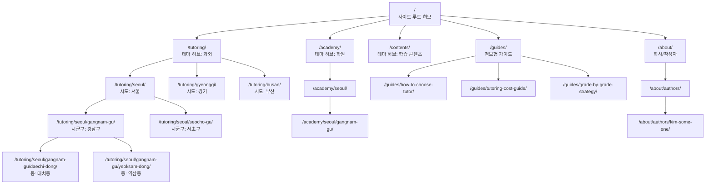
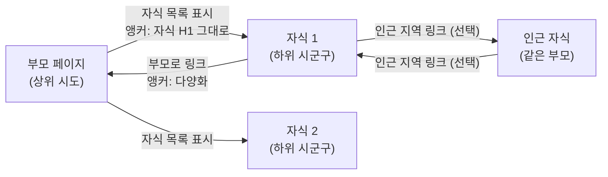
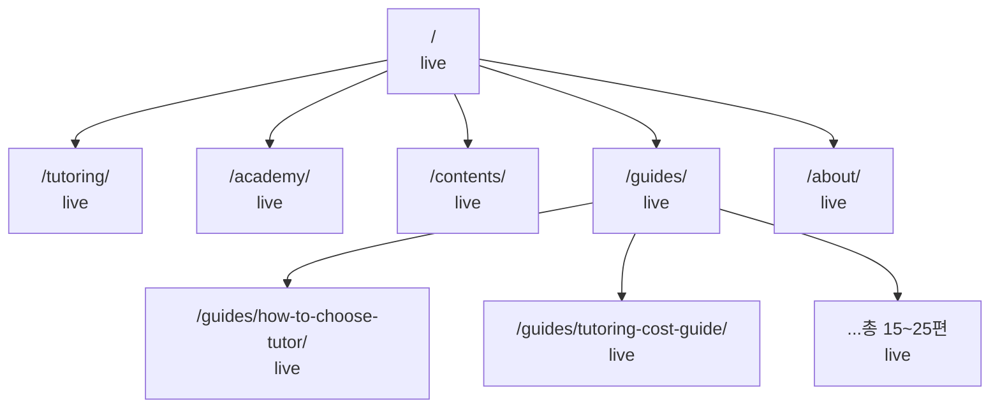
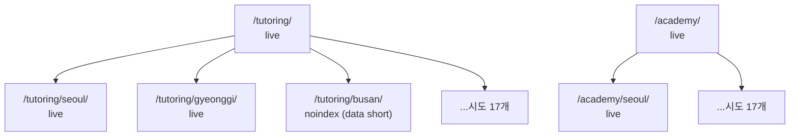
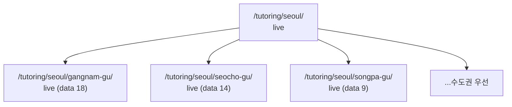
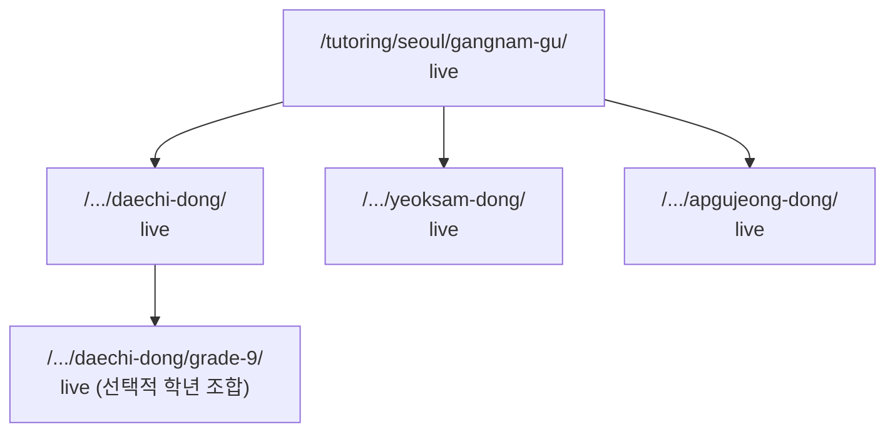
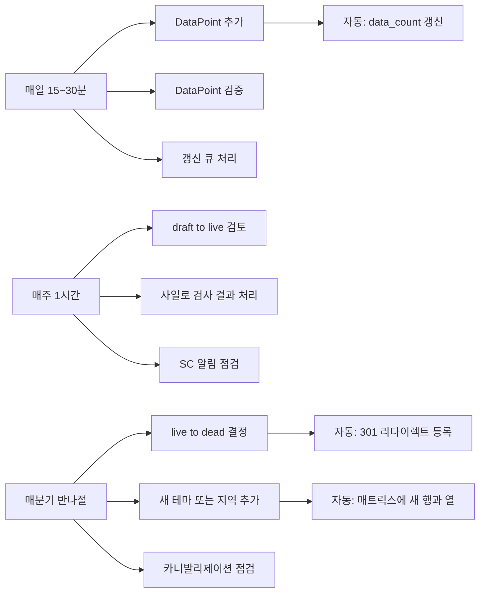

# SEO 프로젝트 사이트 지도

> **목적:** 다(多)테마 × 지역 SEO 사이트의 *공개 URL 트리*와 *5개 운영 뷰*를 통합 정의한다.
> **출처:** `seo-12month-strategy-final.md`, `sitemap-backend-operations-report.md`
> **렌더링 가이드:** Mermaid `flowchart`

---

## 0. 사이트맵의 본질 (한 페이지 요약)

> **사이트맵은 *그리는 것*이 아니라 *데이터 모델로부터 도출되는 것*이다.**

이 문서가 정의하는 것은 다음 두 가지입니다.

1. **공개 URL 트리** — 사용자와 Google이 보는 것. `sitemap.xml`의 원천.
2. **5개 운영 뷰** — 같은 데이터의 다른 슬라이스. 각 뷰는 다른 결정에 쓰인다.

하나의 트리에 모두 섞어넣지 않는 것이 핵심입니다. *결정 종류가 다르면 뷰도 다르다.*

---

## 1. 공개 URL 트리 — Hub-and-Spoke 구조

사용자와 검색엔진에게 노출되는 URL 구조입니다. 4단계 깊이가 최대치입니다.



### 1.1 URL 깊이 규칙

| 깊이 | 의미 | 예시 |
|------|------|------|
| 0 | 사이트 루트 | `/` |
| 1 | 테마 허브 | `/tutoring/`, `/academy/`, `/guides/` |
| 2 | 테마 × 시도 | `/tutoring/seoul/` |
| 3 | 테마 × 시도 × 시군구 | `/tutoring/seoul/gangnam-gu/` |
| 4 | 테마 × 시도 × 시군구 × 동 | `/tutoring/seoul/gangnam-gu/daechi-dong/` |

**금지:** 깊이 5 이상. 크롤 깊이 한계로 권위가 도달하지 못합니다.

### 1.2 부모-자식 링크 규칙



**규칙:**
- *자식 → 부모* (필수): 권위 되돌림. 앵커 텍스트는 *다양화* (전체 키워드 / 부분 키워드 변형).
- *부모 → 자식* (필수): 발견성. 앵커는 자식의 H1 그대로.
- *자식 → 자식* (선택): 인근 지역 또는 동일 테마만. 사일로 침범 금지.
- **금지:** 다른 테마 자식으로의 직접 링크 (`/tutoring/seoul/gangnam-gu/` → `/academy/seoul/gangnam-gu/`).

---

## 2. 12개월 단계별 발행 트리 진화

각 Phase 종료 시점의 트리가 어디까지 자라야 하는지 보여줍니다.

### 2.1 Phase 1 종료 (Month 3) — 깊은 허브만



**합계:** 25~35개. 지역 페이지 0개. 자식 페이지 0개. 노출(impression)만 시작되고 클릭은 거의 없는 시기입니다.

### 2.2 Phase 2 종료 (Month 6) — 시도 행 채우기



**합계 추가:** 약 51개 (테마 3 × 시도 17). 일부 시도는 데이터 부족으로 `noindex` 상태입니다.

### 2.3 Phase 3 종료 (Month 9) — 데이터 충족 시군구



**핵심 결정 규칙:** Search Console에서 *검색이 발생한* 시군구만 발행. 데이터 5개 미만이면 `noindex`.

### 2.4 Phase 4 종료 (Month 12) — 동 단위 + 학년 조합



**12개월 누적 합계:** 335~705개. 인덱스 된 시군구의 동만 발행됩니다.

---

## 3. 5개 운영 뷰 — 같은 데이터의 다른 결정

사이트맵은 하나의 트리가 아니라 *5개 뷰의 합*입니다. 각 뷰는 다른 결정에 쓰입니다.

### 3.1 발행 트리 뷰 (Public Tree View)

**용도:** 일상 모니터링, 신규 페이지 검토, `sitemap.xml` 생성.

§1~2에서 정의한 공개 URL 트리가 곧 이 뷰입니다. `status='live'`인 노드만 포함합니다.

### 3.2 데이터 매트릭스 뷰 (Data Matrix View)

**용도:** 운영자의 매일 작업 현황판. 어느 칸을 채워야 하는지 한눈에.

|  | 과외 | 학원 | 학습콘텐츠 | 입시도구 |
|---|---|---|---|---|
| 서울 강남구 | ✅ 9 | ✅ 12 | ✅ 15 | △ 6 |
| 서울 서초구 | ✅ 7 | ✅ 5 | ✅ 8 | △ 3 |
| 서울 송파구 | ✅ 6 | △ 4 | △ 2 | ✗ 0 |
| 경기 군포시 | ✅ 8 | △ 3 | △ 1 | ✗ 0 |
| 부산 금정구 | △ 2 | ✅ 5 | ✗ 0 | ✗ 0 |

**범례:** ✅ `live` (data≥5) / △ `noindex` (data 1~4) / ✗ `dead` (data 0)

**가장 효율적인 작업 패턴:** ✅ → △ → ✗. 검색 의도는 검증되고, 데이터만 부족한 칸. 데이터 1~2개만 추가하면 발행 가능합니다.

### 3.3 KPI 히트맵 뷰 (KPI Heatmap View)

**용도:** 분기 정리 회의. 어릴지 / 통합할지 / 삭제할지 결정.

| URL | 인덱스 | 노출 | 클릭 | 평균순위 | 판단 |
|-----|--------|------|------|----------|------|
| `/tutoring/` | ✓ | 8,200 | 320 | 11.2 | ▲ 유지 |
| `/tutoring/seoul/` | ✓ | 3,400 | 145 | 14.8 | ▲ 유지 |
| `/tutoring/seoul/gangnam-gu/` | ✓ | 1,200 | 62 | 18.3 | ▲ 유지 |
| `/.../daechi-dong/` | ✗ | 15 | 0 | 62.1 | ✗ 6개월 미인덱스 → 통합 검토 |
| `/.../yeoksam-dong/` | ✓ | 380 | 23 | 24.5 | △ 보강 필요 |
| `/academy/` | ✓ | 2,100 | 89 | 16.7 | ▲ 유지 |

데이터 소스는 Search Console API → `ContentNode.kpi_snapshot`(JSONB) 캐시입니다.

### 3.4 사일로 무결성 뷰 (Silo Integrity View)

**용도:** 매주 자동 실행, 위반 즉 알림.

```
검사: /tutoring/seoul/gangnam-gu/
  ✓ 부모: /tutoring/seoul/ (같은 테마, depth 차이 1)
  ✓ 자식 4개, 모두 같은 테마
  ✗ 외부 링크 1건: /academy/seoul/gangnam-gu/ → 다른 테마 직접 링크
       → 사일로 침범 경고

검사: /tutoring/jeju/
  ✗ 부모 없음 (theme 트리 위반)
       → 고아 페이지

검사: /tutoring/seoul/seocho-gu/banpo-dong/
  ✗ 자식 0, 부모 자식 목록에서 누락
       → 자동 등록 필요
```

검출 항목:
1. 부모 없는 노드 (고아)
2. 다른 테마로의 직접 링크
3. 끊긴 내부 링크
4. 부모 자식 목록에서 누락된 자식
5. depth가 부모와 적합하지 않은 노드

### 3.5 갱신 큐 뷰 (Refresh Queue View)

**용도:** 운영자의 매일 작업 목록. 자동 생성.

```
오늘 갱신해야 할 노드:

[우선순위 1: 90일 미갱신]
  • /tutoring/seoul/gangnam-gu/  (마지막 갱신 95일 전)
  • /academy/gyeonggi/anyang-si/ (마지막 갱신 92일 전)

[우선순위 2: 새 데이터 유입]
  • /tutoring/seoul/seocho-gu/   (DataPoint 3건 추가, 미반영)

[우선순위 3: 노출 급증, 보강 기회]
  • /tutoring/incheon/yeonsu-gu/ (지난주 노출 +180%)

[우선순위 4: 약한 페이지 검토]
  • /tutoring/jeju/seogwipo-si/  (90일 트래픽 0)
```

**자동 큐 생성 규칙:**

| 우선순위 | 트리거 조건 |
|----------|-------------|
| 1 | `now() - last_review_at > 90 days` |
| 2 | 새로 `verified=true`된 DataPoint가 있는데 페이지 미갱신 |
| 3 | Search Console 노출이 전주 대비 +50% 이상 |
| 4 | 90일 트래픽 0인 `live` 노드 |

---

## 4. URL 패턴 — 결정론적 도출

### 4.1 패턴 정의

```
/                                            → 사이트 허브 (특수 처리)
/<theme-slug>/                               → 테마 허브 (region_id=NULL)
/<theme-slug>/<sido>/                        → 시도
/<theme-slug>/<sido>/<sigungu>/              → 시군구
/<theme-slug>/<sido>/<sigungu>/<dong>/       → 동
/guides/<topic-slug>/                        → 정보형 (region 없음)
/about/authors/<author-slug>/                → 작성자
```

### 4.2 패턴이 보장하는 5가지 이점

| 이점 | 설명 |
|------|------|
| **카니발리제이션 원천 방지** | `(theme, region)` UNIQUE 제약으로 중복 URL 생성이 *DB 레벨에서* 불가능 |
| **계층 권위 흐름** | URL 깊이 = 권위 단계. 부모 URL이 자식 URL의 prefix |
| **사이트맵 자동 생성** | `status='live'`인 노드 SELECT가 곧 `sitemap.xml` |
| **운영자 인지 부하 최소화** | URL만 봐도 어느 데이터 행인지 안다 |
| **canonical 문제 소거** | URL이 함수의 출력이므로 다른 표현이 존재할 수 없다 |

### 4.3 금지 패턴

| 금지 | 이유 |
|------|------|
| `?theme=...&region=...` | Google이 다른 페이지로 인지 안 함 |
| `/seoul/tutoring/` (지역 우선) | 테마 허브 권위가 분산됨 |
| 같은 콘텐츠를 여러 URL이 가리킴 | canonical 처리해도 권위 누수 |
| 깊이 5 이상 URL | 크롤 깊이 한계 |

---

## 5. `sitemap.xml` 자동 생성 — 발행 트리 뷰의 구체화

### 5.1 생성 쿼리

```sql
-- sitemap.xml 생성용 SELECT
SELECT
    build_url(theme_id, region_id) AS loc,
    last_review_at AS lastmod,
    CASE depth
        WHEN 0 THEN 1.0
        WHEN 1 THEN 0.9
        WHEN 2 THEN 0.7
        WHEN 3 THEN 0.5
        WHEN 4 THEN 0.3
    END AS priority,
    CASE
        WHEN depth <= 1 THEN 'weekly'
        WHEN depth = 2 THEN 'monthly'
        ELSE 'monthly'
    END AS changefreq
FROM content_node cn
LEFT JOIN region r ON cn.region_id = r.id
WHERE status = 'live'
ORDER BY depth, theme_id, region_id;
```

### 5.2 cron 일정

| 작업 | 주기 | 결과 |
|------|------|------|
| `sitemap.xml` 재생성 | 매일 03:00 | 정적 파일 갱신 |
| Search Console ping | 재생성 직후 | 변경 감지 트리거 |
| Search Console API 동기화 | 매일 04:00 | `kpi_snapshot` 갱신 |
| 사일로 무결성 검사 | 매주 월요일 02:00 | 위반 시 운영자 알림 |
| 갱신 큐 재계산 | 매일 06:00 | 운영자 출근 전 준비 |

---

## 6. 운영자가 실제로 하는 일 — 만지는 것은 데이터뿐

운영자는 *URL이나 HTML을 만지지 않습니다.* 다음 작업만 합니다.



**핵심 원칙:** 운영자가 만지는 것은 5개 엔티티의 행뿐입니다. URL, 사이트맵, HTML, 리다이렉트, 내비게이션은 모두 *코드가 만듭니다.*

---

## 7. 분기 마일스톤 요약

| 분기 | 트리 깊이 도달 | 페이지 수(누적) | 5개 뷰 상태 |
|------|------------------|------------------|--------------|
| **Q1** (Month 1~3) | 깊이 1 (테마 허브) | 25~35 | 발행 트리, 매트릭스, 갱신 큐 가동 |
| **Q2** (Month 4~6) | 깊이 2 (시도) | 75~95 | KPI 히트맵 가동 |
| **Q3** (Month 7~9) | 깊이 3 (시군구) | 185~305 | 사일로 무결성 자동화 완성 |
| **Q4** (Month 10~12) | 깊이 4 (동/조합) | 335~705 | 5개 뷰 모두 안정 운영 |

---

## 8. 핵심 메시지

1. **사이트맵은 5개 뷰다.** 발행 트리, 데이터 매트릭스, KPI 히트맵, 사일로 무결성, 갱신 큐. 각각 다른 결정에 쓰인다.
2. **공개 URL 트리는 4단계 깊이가 최대다.** 사이트 → 테마 → 시도 → 시군구 → 동.
3. **URL은 `(theme, region)` 함수의 출력이다.** 손으로 만들지 않으며 다른 표현이 존재할 수 없다.
4. **`sitemap.xml`은 SQL 한 줄에서 나온다.** `WHERE status='live'`로 필터링한 결과가 곧 사이트맵이다.
5. **운영자는 데이터만 만진다.** URL, HTML, 리다이렉트, 내비게이션은 코드가 만든다. *이것이 12개월 운영을 지속가능하게 만드는 단일 결정이다.*
